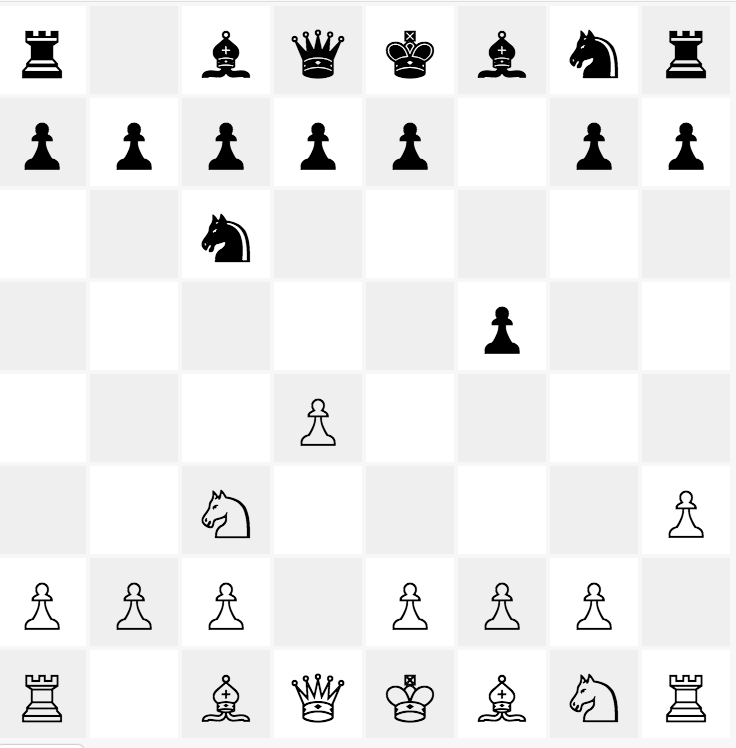

# Chees Game with React


```jsx
<ChessGame stateString={"6x8428a6cccccxccxxaxxxxxxxxxxcxxxxxbxxxxxx9xxxxbbbbxbbbx5x7317951"}>
  <Hud player={gameState.player} />
  <Board pieces={gameState.pieces}
         onTileClick={}
         selected={gameState.selected}
         size={36} />
</ChessGame>
```

## Components

### ChessGame

Whole game state is held and all the game logic handled in this component. 

### Board

Renders the given chess board state. Exposes some events for ChessGame components such as `tileClicked(:tileIndex)`.

### Piece

## Datastructures

Game state is held in this structure

```js
const gameState = {
	pieces: [[]],       // 8x8 pieces array
	selected: [i, j],   // selected piece row&col values
	player: 0           // current player (0: white, 1:black)
}
```

```
const piece = {
	icon: "",
	type: 3
}
```
